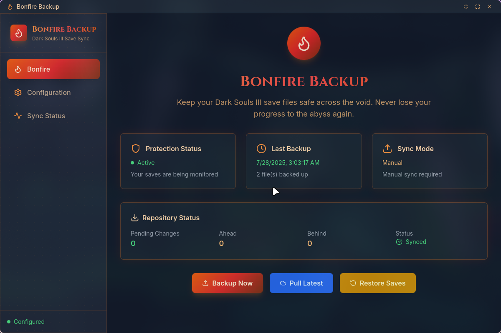

# 🔥 Bonfire Backup

## BETA BRANCH

This is a beta branch, here I will attempt to implement the following features:

- [ ] **In-App Updates**  
  Seamless updates without visiting GitHub.

- [ ] **Simple Remote Repo Auth**  
  Skip SSH keys and GitHub CLI,  use GitHub OAuth or similar.

- [ ] **macOS Compatibility (Optional)**  
  Support macOS for the few brave Souls players on Mac 😅

> Keep your Dark Souls III save files safe across the void. Never lose your progress to the abyss again.

Bonfire Backup is a Dark Souls III save file backup, and synchronization tool to keep your game progress using Git version control.

*Submitted for the Boot.dev Hackathon 2025* 🏆



## ✨ Features

- 🛡️ **Automatic Save Detection** - Finds your Dark Souls III saves automatically
- ☁️ **Git-Based Backup** - Version control for your save files with remote sync
- 🔄 **Auto-Sync** - Real-time file watching with automatic backups
- 📁 **Manual Backup & Restore** - Full control over your save management

## 🚀 Quick Install

### Linux
```bash
curl -sSL https://raw.githubusercontent.com/mmrmagno/bonfire-backup/main/install.sh | bash
```

### Windows (PowerShell as Administrator)
```powershell
irm https://raw.githubusercontent.com/mmrmagno/bonfire-backup/main/install.ps1 | iex
```

## 🎮 Getting Started

1. **Launch Bonfire Backup** from your application menu or run `bonfire-backup`
2. **Configure Save Path** - Usually auto-detected for Dark Souls III
3. **Set Repository URL** - GitHub/GitLab repo for cloud sync  
4. **Enable Auto-Sync** - Let the app monitor and backup automatically
5. **Praise the Sun!** ☀️ - Your saves are now protected

## 🧪 Testing (Boot.dev Reviewers)

Don't have Dark Souls III? No problem! Create a test save file anywhere on your system:

```bash
# Create a test save file
echo "test save data" > DS30000.sl2
```

Then manually set the path to this test file in the application's configuration. The app will detect and backup this test file just like a real save!

## 🤝 Contributing

This is a hackathon project for Boot.dev 2025! Feel free to:
- Report bugs or issues
- Submit pull requests  
- Share feedback

## 📜 License

MIT License - see [LICENSE](LICENSE) for details.

---

**Praise the Sun!** ☀️

*Remember: A true Undead never loses hope... or their save files.*
